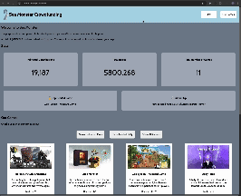

# WEB102 Prework - *Crowdfunding Core*

Submitted by: **Kelly Yu**

**Crowdfunding Core** is a website for the company Sea Monster Crowdfunding that displays information about the games they have funded.

Time spent: **3** hours spent in total

## Required Features

The following **required** functionality is completed:

* [x] The introduction section explains the background of the company and how many games remain unfunded.
* [x] The Stats section includes information about the total contributions and dollars raised as well as the top two most funded games.
* [x] The Our Games section initially displays all games funded by Sea Monster Crowdfunding
* [x] The Our Games section has three buttons that allow the user to display only unfunded games, only funded games, or all games.

The following **optional** features are implemented:

* [x] A navbar with two buttons for users to jump to the Stats section or the Our Games section.
* [x] Cursor changes to a pointer when users hover any buttons.
* [x] Button and paragraph texts' font sizes are larger.

## Video Walkthrough

Here's a walkthrough of implemented features:

GIF created with [Kap](https://getkap.co/).
<!-- Recommended tools:
[Kap](https://getkap.co/) for macOS
[ScreenToGif](https://www.screentogif.com/) for Windows
[peek](https://github.com/phw/peek) for Linux. -->

## Notes

While implementing this application, one challenge I encountered was destructuring arrays and Objects. During my first iteration, the variables initialized through destructuring an array worked, but not the ones initialized through destructuring with Objects. The latter only initialized the last variable in a group of space-separated variables. I used the console log to debug, referred to documentations, and tested the documentation's sample code to get an understanding of how destructuring worked with different variable types. After that, I realized how correct my syntax and successfully destructure Object variables.

## License

    Copyright [yyyy] [name of copyright owner]

    Licensed under the Apache License, Version 2.0 (the "License");
    you may not use this file except in compliance with the License.
    You may obtain a copy of the License at

        http://www.apache.org/licenses/LICENSE-2.0

    Unless required by applicable law or agreed to in writing, software
    distributed under the License is distributed on an "AS IS" BASIS,
    WITHOUT WARRANTIES OR CONDITIONS OF ANY KIND, either express or implied.
    See the License for the specific language governing permissions and
    limitations under the License.
